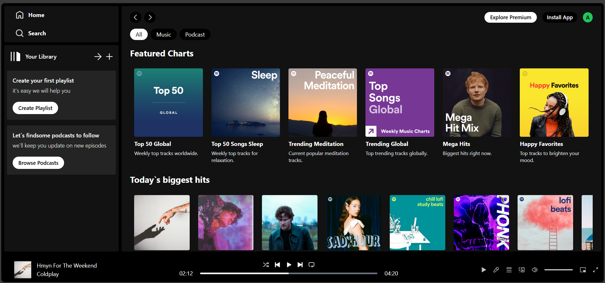

# 🎵 Spotify Clone – Week 5 Assignment

A sleek and responsive Spotify-like music app built using **React.js**, **Vite**, and **Tailwind CSS**. This project features a functional music player UI with context-based state management.



## 🚀 Features

- 🎧 Music Player Interface (Play, Pause)
- 📱 Fully Responsive Design
- 🧭 Sidebar Navigation
- 🔍 Song Display & Details
- ⚛️ React Context API for State

## 🛠 Tech Stack

- React.js
- Tailwind CSS
- Vite
- Context API
- PostCSS

## 📦 Installation

```bash
cd Spotify-Clone
npm install
npm run dev
